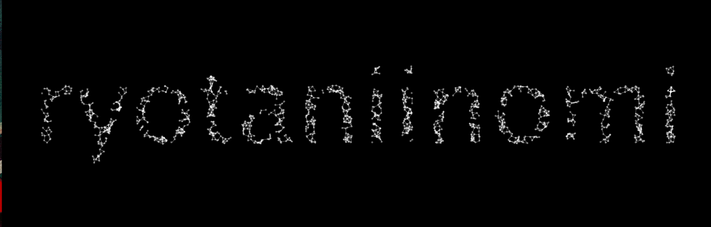

アニメーションする文字を生成するTextEditorぽいもの（TextEditorなんて大層なものじゃない）をつくった。  

## 解説
ポイントは`PGraphics`を使う点だろう。  
`PGraphics`とは別画面のようなもの。  
テキストやグラフィックを描画することができるのだが、その結果は画面上には反映されない。  
裏側で仮の描画を行ったり、描画を保存しておいたりする際に使うそう。  
今回はこの`PGraphics`を用いてTextEditorをつくる。  

#### PGraphicsの生成サンプル
```
PGraphics pg;
void setup() {
    size(400, 400);
    background(0);
    rectMode(CENTER);

    pg = createGraphics(width, height, JAVA2D);
    pg.beginDraw();
    pg.textSize(12);
    pg.textAlign(CENTER, CENTER);
    pg.fill(255);
    pg.text("Hello", pg.width/2, pg.height/2);
    pg.endDraw();

    // 描画
    image(pg, 0, 0);
}
```
これで以下のように描画される。  
シンプルである。  


以下に実際のコードを抜粋していく。

### 初期パーティクルの生成
```
// 画面の分割数
// この値が大きいと点の間隔が狭くなり、細かいパーティクルができる
int gridX = 100;
int gridY = 130;

void initParticles() {
    particles = new ArrayList();

    // 点同士の間隔
    float w = float(width) / gridX;
    float h = float(height) / gridY;

    for (int y = 0; y < gridY; y++) {
        for (int x = 0; x < gridX; x++) {
            // 描画する点の位置
            float vx = w * x;
            float vy = h * y;

            // 点の位置がテキスト内に入ってればパーティクルを生成しリストに保存
            if (isInsideText((int)vx, (int)vy)) {
                Particle particle = new Particle(new PVector(vx, vy));
                particle.display();
                particles.add(particle);
            }
        }
    }
}
```

### ある点がPGraphicsに描画したグラフィック上に位置するかの判定
```
boolean isInsideText(int x, int y) {
    // 座標から取得した点の色が描画色のものと一致するかどうかで判定
    return (pg.get(x, y) == PGRAPHICS_COLOR);
}
```
`PGraphics#get`でその座標の色を取得できるので、それを使う。  
ちなみに、ここで使っている`PGRAPHICS_COLOR`は、`PGraphics#fill`で設定する色である。  

### 描画
```
void draw() {
    background(BACKGROUND_COLOR);

    for (int i = 0, len = particles.size(); i < len; i++) {
        Particle baseParticle = particles.get(i);
        PVector baseLocation = baseParticle.getLocation();

        // 点が文字の外に出たら方向を変える
        // TODO：現状はx方向にはみ出たかy方向にはみ出たかの判定ができてないので修正したい
        if (!isInsideText((int)baseLocation.x, (int)baseLocation.y)) {
            baseParticle.updateDir(-1, -1);
        }
        baseParticle.update();
        baseParticle.display();

        // 点同士を線で結ぶ
        for (int k = i+1; k < particles.size(); k++) {
            Particle targetParticle = particles.get(k);
            PVector targetLocation = targetParticle.getLocation();
            // 次の点との距離を計算
            float dist = baseLocation.dist(targetLocation);

            // 処理が閾値以下であれば描画
            if (dist != 0 && dist < 10) {
                stroke(255, 100);
                strokeWeight(1);
                line(baseLocation.x, baseLocation.y, targetLocation.x, targetLocation.y);
            }
        }
    }
}
```

### 点の描画を行うParticleクラス
```
class Particle {
    PVector location;
    float radius;
    float dirX;
    float dirY;

    Particle(PVector location) {
        this.location = location;
        radius = 4;
        dirX = random(-1, 1);
        dirY = random(-1, 1);
    }

    PVector getLocation() {
        return location;
    }

    // 位置を更新
    void update() {
        PVector velocity = new PVector(dirX, dirY);
        location.add(velocity);
    }

    // 方向を変える（跳ね返り）
    void updateDir(int x, int y) {
        dirX *= x;
        dirY *= y;
    }

    void display() {
        fill(255, 100);
        noStroke();
        ellipse(location.x, location.y, radius, radius);
    }
}
```
点の数だけこれをインスタンス化して使う。  

できたものはこれ。  

<iframe width="420" height="315" src="https://www.youtube.com/embed/-6pOM5faOIY" frameborder="0" allowfullscreen></iframe>


以上です。  

[コード](https://github.com/nomi1126/processing_work/tree/master/2015_07_05_animationText/animationText)
