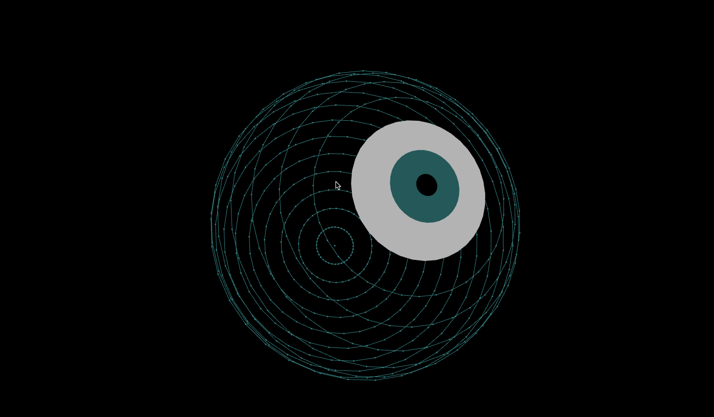

[こちらの記事](http://p5aholic.hatenablog.com/)を参考に眼球を描いてみた。  

眼球はマウスカーソルに追従するようになってる。  
## ざっくり解説
球体の描き方は↑に丁寧にまとめられてるのでそちらを参照すると良い。  
球体は`point()`で円上に配置した点をZ軸の上に半径を変えて重ねている。  
ボールを輪切りにしたようなイメージかも。  
目ん玉の部分は塗りを有効にするために`beginShape()`と`endShape()`を用いており、`vertex()`によって点を描画している。  
眼球描画部分のコードを以下に載せておく。  
#### EyeBall.pde
```
class EyeBall {

    float radius = 200;
    float dir = 1;
    float val = 0;
    float lastX;
    float lastY;
    float lastZ;

    EyeBall() {}

    void display() {
        val += 5;

        for(int s = 0; s <= 180; s += 10){
            float radianS = s == 0 ? radians(3) : radians(s);
            float expansion = map(sin(radians(val)), -1, 1, 1, 1.5);
            float z = radius * cos(radianS) * expansion;

            // Eye
            if (s <= 20) {
                noStroke();
                if (s == 20) {
                    fill(255, 255, 255, 180);
                } else if (s == 10) {
                    fill(0, 128, 128, 180);
                } else {
                    fill(0, 100);
                }
                // Fill eye
                beginShape();
                for (int t = 0; t <= 360; t += 10) {
                    float radianT = radians(t);
                    float x = radius * sin(radianS) * cos(radianT) * expansion;
                    float y = radius * sin(radianS) * sin(radianT) * expansion;
                    vertex(x, y, z);
                }
                endShape();
            }
            // Oval
            else {
                for(int t = 0; t <= 360; t += 10){
                    float radianT = radians(t);
                    float x = radius * sin(radianS) * cos(radianT) * expansion;
                    float y = radius * sin(radianS) * sin(radianT) * expansion;
                    stroke(0, 128, 128);
                    strokeWeight(3);
                    point(x, y, z);

                    // Connect points with line
                    if (t != 0) {
                        strokeWeight(1);
                        line(x, y, z, lastX, lastY, lastZ);
                    }

                    lastX = x;
                    lastY = y;
                    lastZ = z;
                }
            }
        }
    }
}
```
フルコードは[こちら](https://github.com/nomi1126/processing_work/tree/master/2015_06_21_eye/eye)
