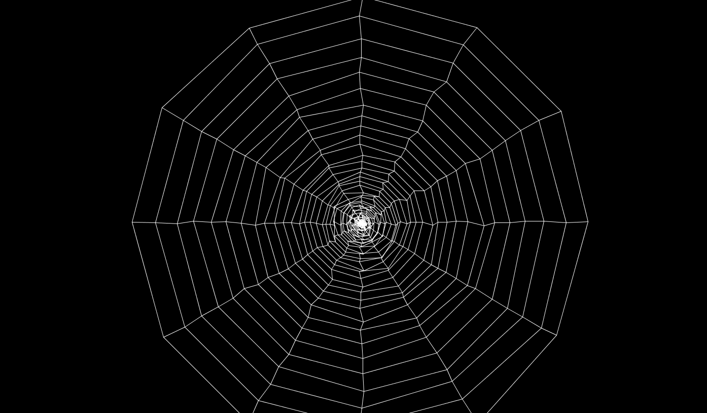

流れは以下

- 多角形の頂点を作成
- 多角形になるように頂点を結ぶ線分を作成
- 外側から内側の多角形へ頂点を結ぶ線分を作成

各頂点座標にランダム値をプラスすることで微弱な揺れを表現してる

#### spider.pde
```
ArrayList<ArrayList<Particle>> particleGeneration;  // 各点の位置用
ArrayList<ArrayList<Connection>> connectionGeneration;  // 各点を繋ぐ線用
ArrayList<ArrayList<Connection>> boneGeneration;  // 外から内に向かう線用

int count = 12;
int radius;
int distance = 360 / count;

void setup() {
    size(displayWidth, displayHeight);
    radius = displayHeight / 2;
    particleGeneration = new ArrayList();
    connectionGeneration = new ArrayList();
    boneGeneration = new ArrayList();

    for (int k = 0; radius > 0; k++) {
        ArrayList<Particle> particles = new ArrayList();
        ArrayList<Connection> connections = new ArrayList();

        for (int i = 0; i < count; i++) {
            // 点を作成
            Particle particle = new Particle(new PVector(radius * cos(radians(i*distance)), radius * sin(radians(i*distance))));
            particles.add(particle);

            // 点同士を繋ぐ線を作成
            if (i != 0) {
                Connection connection = new Connection(particle, particles.get(i-1));
                connections.add(connection);
            }
            if (i == count - 1) {
                Connection connection = new Connection(particle, particles.get(0));
                connections.add(connection);
            }
        }

        particleGeneration.add(particles);
        connectionGeneration.add(connections);

        // 外から内に向かう線を作成
        for (int i = 0; i < count; i++) {
            if (k != 0) {
                ArrayList<Connection> bones = new ArrayList();
                Connection bone = new Connection(particleGeneration.get(k).get(i), particleGeneration.get(k-1).get(i));
                bones.add(bone);
                boneGeneration.add(bones);
            }
        }
        radius -= radius * 0.1;
    }
}

void draw() {
    background(0);
    translate(width/2, height/2);
    for (ArrayList<Particle> p : particleGeneration) {
        for (Particle particle : p) {
            particle.update();
            particle.display();
        }
    }
    for (ArrayList<Connection> c : connectionGeneration) {
        for (Connection connection : c) {
            connection.display();
        }
    }
    for (ArrayList<Connection> b : boneGeneration) {
        for (Connection bone : b) {
            bone.display();
        }
    }
}
```

#### Connection.pde
```
class Connection {
    Particle p1;
    Particle p2;

    Connection(Particle p1, Particle p2) {
        this.p1 = p1;
        this.p2 = p2;
    }

    void display() {
        stroke(255);
        line(p1.getLocation().x, p1.getLocation().y, p2.getLocation().x, p2.getLocation().y);
    }
}
```

#### Particle.pde
```
class Particle {
    PVector location;
    float radius = 0;
    float moving = 0;
    float maxRange = 5;

    Particle(PVector location) {
        this.location = location;
    }

    PVector getLocation() {
        return location;
    }

    void update() {
        float m = getRandom();
        // ブレ幅を設定
        if (moving + m < maxRange && moving + m > -maxRange) {
            moving += m;
            location.add(new PVector(m, m));
        }
    }

    float getRandom() {
        return random(-0.5, 0.5);
    }

    void display() {
        fill(255);
        noStroke();
        ellipse(location.x, location.y, radius, radius);
    }
}
```
[コード](https://github.com/nomi1126/processing_work/tree/master/2015_06_18_spider/spider)
