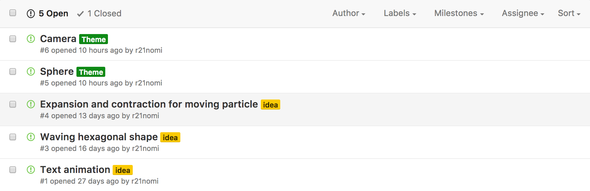

この記事は[クリエイティブコーディング Advent Calendar 2016](http://qiita.com/advent-calendar/2016/creative-coding) 20日目の投稿である。

# TL;DR
- 1日1個スケッチをする
- 1テーマに決めてやる
- 30分でやる

# 1日1スケッチ
毎日30分、決めたテーマに沿ってスケッチをする。  
自分の場合はopenFrameworksを使うのだが、processingでもjavascriptでも何でも良いと思う。  
30分1テーマってところがポイントで、毎日継続することに意味がある。  
この活動のインスパイア元は「[30 min. Processing](http://30min-processing.hatenablog.com/)」というブログ。

# 目的
### 動きの学習のため
アプリ, web, インスタレーション問わず目に見える部分に凝りたいと思っているので、動きの学習をすることはカッコよく気持ち良いモノをつくるのに重要だ。  

また、自分は普段はアプリをつくる仕事をしているのだが、クリエイティブコーディングのアルゴリズムは他のプラットフォーム（アプリ、web）のインタラクション実装にも活かせると思う。  
この辺りは別の機会にまとめたい。

### 楽しい
カッコイイもの、気持ち良いものをつくるのは単純に楽しい。

# やり方
やり方ってほどでもないが、自分がいつもやっていることを書く。

### 1テーマを決めてやる
テーマを決めてやることでその実装のみに集中できる。  
例えば、`Blob`や`Pattern`, `Transform`といった感じ。  

また、テーマを決めることで一つ一つの実装量がシンプルになるので、実装方法を忘れた時に検索しやすくなるのも良いポイントである。

### 30分でやる
短時間に制限することで継続できるようにする。  
30分という時間は正直短いが、前につくったスケッチを元にブラッシュアップしていくと30分でもそれなりに大きな作品にできる。  
継続することが大事なのだ。

### Githubにまとめておく
コードベースでスケッチを保存する場として、[Github等のリポジトリ](https://github.com/r21nomi/of-artwork)にまとめておくと良い。  
視覚的にスケッチを見れるよう、最初はトップのREADMEにGIF画像を貼っていったが次第に重くなっていったので、視覚的なスケッチの保存は別の箇所で行うことにした。  

また、同じテーマでブラッシュアップしていく場合でも各スケッチごとにプロジェクトをつくっておくとそれそれの違いがわかって良い。  

### GIFを一覧できるページにあげる
ブログなど視覚的に成果を見れるページにあげておく。  
後から視覚的に見て実装を確認できるのと、溜まっていく感が楽しいからだ。  

自分の場合は[Tumblr](https://ofartwork.tumblr.com/)に上げていっている。

GIF画像とそのコードへのリンクを貼っておけばあとで参照できる。

### シェアする
これはおまけなのだが、モチベーションを維持する意味でつくったスケッチはSNSにシェアするようにしてる。  
因みに、oFの父Zach氏も定期的にTwitterにスケッチをポストしている。  
<blockquote class="twitter-tweet" data-lang="ja">
porcupine font <a href="https://t.co/ftQtytlWyQ">pic.twitter.com/ftQtytlWyQ</a>
&mdash; zach lieberman (@zachlieberman) <a href="https://twitter.com/zachlieberman/status/810967626096803840">2016年12月19日</a></blockquote>

# アイデアはissueにまとめておく
いざスケッチをしようと思っても何やろうかなかなか思いつかないこともあるので、実装してみたいアイデアを
[issue](https://github.com/r21nomi/of-artwork/issues)とかにストックしておくと良いと思う。  

# まとめ
一連の流れは以下の通り。  

1. テーマのディレクトリを作成
2. テーマディレクトリ配下にoFの`projectGenerator`でprojectを作成
3. 以前のスケッチをブラッシュアップする場合は、ファイルをコピペ。Xcodeにも`add files`でファイル追加。
4. 30分でスケッチ
5. GIF画像で記録（自分は[LICEcap](http://www.cockos.com/licecap/)使ってる）
6. Githubのリポジトリにpush
7. TumblrにGIFをポスト
8. SNSでシェア

これを自分の場合は、毎朝行うようにしてる。  
朝できなかった場合は、その日の夜か次の日に2つ投稿するなどしてる。  
投稿できなくても自分を責めないことも継続する上では大事。

30分なら毎日続けられるし、少しづつスケッチが溜まっていくのは楽しいのでとてもおすすめ。  
ではでは。

[https://github.com/r21nomi/of-artwork](https://github.com/r21nomi/of-artwork)  
[https://ofartwork.tumblr.com/](https://ofartwork.tumblr.com/)
