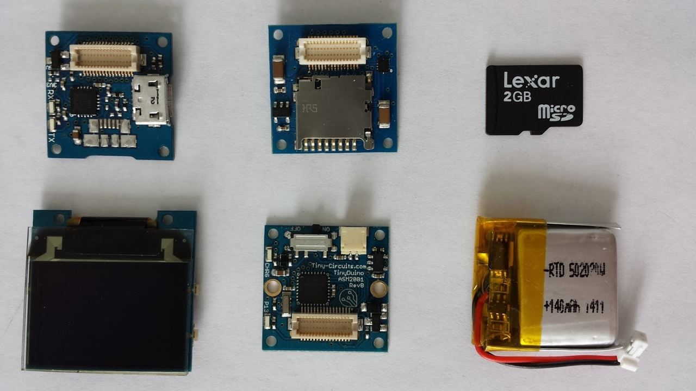

[TinyScreen](https://tinycircuits.com/)というとても小さなArduino互換のディスプレイがあるのだが、今回はこれにGIF画像を表示する方法をメモしておく。  

# TinyScreenとは
冒頭でも述べたが、親指サイズの非常に小さなArduino互換デバイスである。  
詳しくは、[公式サイト](https://tinycircuits.com/)をみると良い。  

# MICROSD TINYSHIELDを使ってGIFを表示する

GIFの表示には、TinyScreen本体に加えて[MICROSD TINYSHIELD](https://tinycircuits.com/collections/all/products/microsd-tinyshield)と
いうモジュールが必要になる。  
こちらは、文字通りMicroSD内のファイルを読み込めるようにするモジュールで、今回はこの中に保存されているGIFを表示する方法を紹介する。

紹介といっても、すでにコードと解説は[こちら](https://tinycircuits.hackster.io/tbatey_tiny-circuits/tinyscreen-animated-and-static-images-abefde)に載っているので、重複する部分も多々あるがもう少し細かく説明しておこうと思う。  

## Gif -> TSVファイルへの変換
TSVとはデータとデータの間がタブで区切られているテキストファイル。  
表示するGIF画像はこのTSV形式に変換しておかないとプログラムで表示できないので、ここではその変換を行う。

### 準備
[こちら](https://tinycircuits.hackster.io/tbatey_tiny-circuits/tinyscreen-animated-and-static-images-abefde)から`TSVconverter.py`ファイルをDLする。  
GIFファイルを`TSVconverter.py`ファイルと同階層においておく。

### 変換
`TSVconverter.py`ファイルをpythonコマンドで実行すればTSVファイルが生成される。
```
$ python TSVconverter.py
```

### エラーが出た時の対応
初めて`python TSVconverter.py`を実行する場合、おそらくこんなエラーが出る。
```
Traceback (most recent call last):
File "TSVconverter.py", line 2, in <module>
from PIL import Image
ImportError: No module named PIL
```
`PIL`がインストールされてないらしい。

### PIL（pillow）のインストール
まずは、pipをインストール。  
```
$ curl -kL https://bootstrap.pypa.io/get-pip.py | python
```
※`Permission denied: '/Library/Python/2.7/site-packages/pip'`エラーが出るかもなので`sudo`つける必要あるかも
```
$ curl -kL https://bootstrap.pypa.io/get-pip.py | sudo python
```

実行
```
$ ./gradlew lint && android-resource-remover --xml app/build/outputs/lint-results.xml
```

次に、PILのforkプロジェクトであるpillowをインストール
```
$ pip install pillow
```
パーミッションエラーが出たらsudoで実行。  

正常にインストールされてることを確認
```
$ pip list
...
Pillow (3.2.0)  // インストールされてるね
...
```

これで`python TSVconverter.py`が正常に動作するようになる。  

参考：http://otiai10.hatenablog.com/entry/2013/12/19/154149````````

## 実行
[こちら](https://codebender.cc/sketch:276406)のプログラムをcodebenderから実行するとプログラムが書き込まれてフォルダの選択画面が表示されるはず。。  
あとは、ディスプレイ横のボタンでメニューを選べばGIFを表示できると思う。

# 余談
完成品をネックレスにするためにケースを探したのだが、それには東急ハンズの[プラスチックキューブ　角　クリア　36mm](https://hands.net/goods/2400005479593/)がちょうどよかった。  
ただ、MicroSDがささってるとちゃんと収まらなかったり、横のボタンが押せなかったりするので、そこは切ったり穴をあけたりと加工した。  

なかなか良い感じに仕上がったので満足しているが、やはりずっとGIFを表示していると電池の消費が激しいね。
