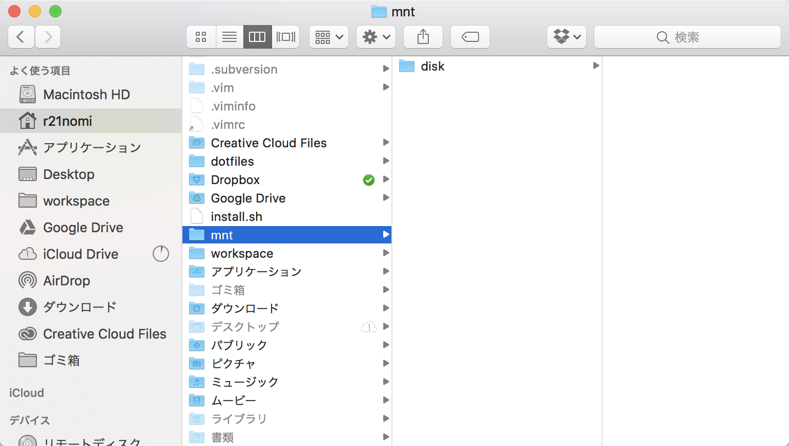
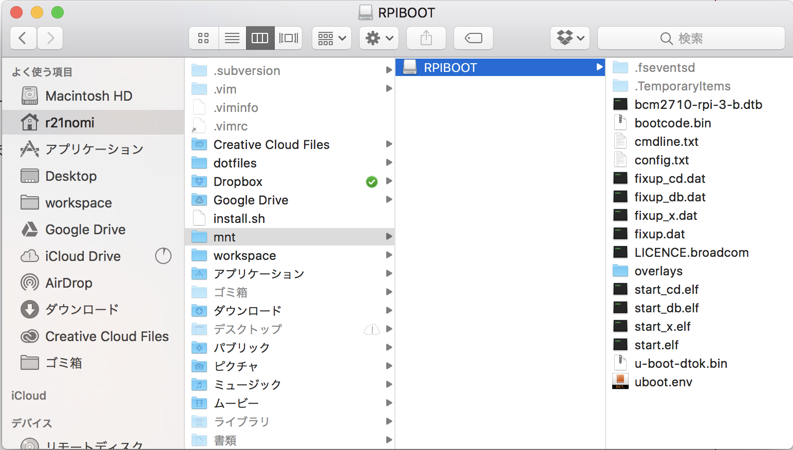
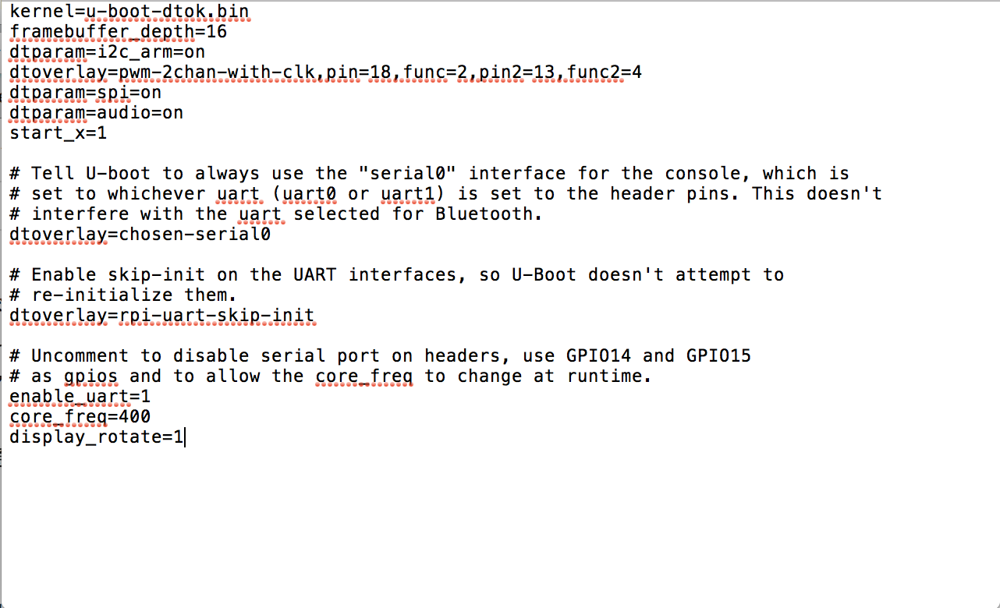
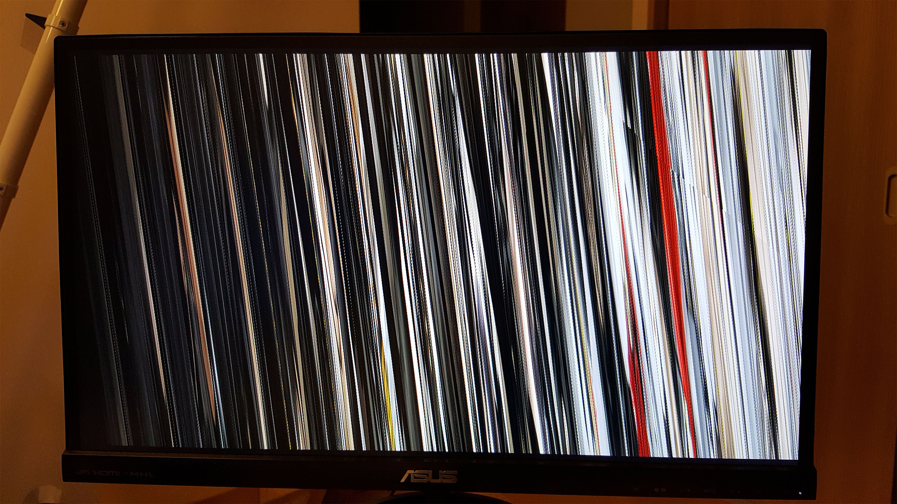

Android Thingsで作ったアプリを表示する画面を縦向きにしたかったので調査してみた。  

結論から先に言うと、Android ThingsでRaspberry Piの画面を縦にするのはできない（表示がぐちゃぐちゃになる）。  
上下逆さまにするのは可能。

## 準備
1. 任意のディレクトリに`mnt/disk`フォルダを作成
2. マウントするディスク名を確認
`$ diskutil list`で確認。

```powershell
$ diskutil list
/dev/disk0 (internal):
   #:                       TYPE NAME                    SIZE       IDENTIFIER
   0:      GUID_partition_scheme                         251.0 GB   disk0
   1:                        EFI EFI                     314.6 MB   disk0s1
   2:          Apple_CoreStorage Macintosh HD            250.0 GB   disk0s2
   3:                 Apple_Boot Recovery HD             650.0 MB   disk0s3

/dev/disk1 (internal, virtual):
   #:                       TYPE NAME                    SIZE       IDENTIFIER
   0:                  Apple_HFS Macintosh HD           +249.7 GB   disk1
                                 Logical Volume on disk0s2
                                 1B8724D6-D1C3-4B9E-81D2-2044A29AB042
                                 Unlocked Encrypted

/dev/disk2 (external, physical):
   #:                       TYPE NAME                    SIZE       IDENTIFIER
   0:      GUID_partition_scheme                        *8.0 GB     disk2
   1: 314F99D5-B2BF-4883-8D03-E2F2CE507D6A               67.1 MB    disk2s1
   2: 314F99D5-B2BF-4883-8D03-E2F2CE507D6A               1.0 MB     disk2s2
   3: 314F99D5-B2BF-4883-8D03-E2F2CE507D6A               1.0 MB     disk2s3
   4: BB499290-B57E-49F6-BF41-190386693794               33.6 MB    disk2s4
   5: BB499290-B57E-49F6-BF41-190386693794               33.6 MB    disk2s5
   6: 0F2778C4-5CC1-4300-8670-6C88B7E57ED6               536.9 MB   disk2s6
   7: 0F2778C4-5CC1-4300-8670-6C88B7E57ED6               536.9 MB   disk2s7
   8: B598858A-5FE3-418E-B8C4-824B41F4ADFC               65.5 KB    disk2s8
   9: B598858A-5FE3-418E-B8C4-824B41F4ADFC               65.5 KB    disk2s9
  10: 6B2378B0-0FBC-4AA9-A4F6-4D6E17281C47               1.0 MB     disk2s10
  11: AA3434B2-DDC3-4065-8B1A-18E99EA15CB7               33.6 MB    disk2s11
  12: AA3434B2-DDC3-4065-8B1A-18E99EA15CB7               33.6 MB    disk2s12
  13: 314F99D5-B2BF-4883-8D03-E2F2CE507D6A               268.4 MB   disk2s13
  14: 314F99D5-B2BF-4883-8D03-E2F2CE507D6A               268.4 MB   disk2s14
  15: 0BB7E6ED-4424-49C0-9372-7FBAB465AB4C               2.7 GB     disk2s15
```

今回マウントするのは`/dev/disk2`のディスク

## マウント、書き込み、マウント解除
ここでは、マウント先ディレクトリはホームディレクトリ直下に作った`mnt/disk`とする。
```powershell
# マウント①
$ sudo mount -t msdos /dev/disk2s1 ./mnt/disk
# 書き込み②
$ echo 'display_rotate=1' >> ./mnt/disk/config.txt
# マウント解除③
$ sudo umount ./mnt/disk
```

マウント前


①マウント後
書き込みできるようになるまで（このアイコンに変わるまで）ほんの少し時間がかかるので、finderでフォルダアイコンが変わるのを確認してから次の書き込みコマンドを実行すると良い。


②書き込み後
`display_rotate=1`がある。  
`display_rotate=1`は時計回りに90°回転の意味。


③マウント解除
finder上の`mnt/disk`の表示がマウント前の状態に戻る。
この状態であればmicrosdの取り出しが可能。

raspberry piを起動。

`display_rotate=1`だと画面表示が崩れてしまう。  
`display_rotate=2`なら正常に上下逆さまになる。

### mountについて
mountとはディスク装置を読み書きできるようにする作業のこと。

usbメモリなどをPCに接続すると画像のようなアイコンがでるが、これがマウントされている状態。  
通常のディスクは接続するだけで自動でマウントされることがほとんどだが、読み込み不可になっているディスクを強制的に読み込む場合などに`mount`コマンドを用いればマウント状態にすることができる。


```powershell
$ mount -t タイプ デバイス マウント先ディレクトリ
```

参考：[http://eng-entrance.com/linux-command-mount](http://eng-entrance.com/linux-command-mount)

## display_rotateの値による効果
設定 | 効果
------------- | -------------
display_rotate=0 | 標準
display_rotate=1 | 時計回りに90°回転する（Android Thingsではうまくいかない）
display_rotate=2 | 時計回りに180°回転する
display_rotate=3 | 時計回りに270°回転する（Android Thingsではうまくいかない）
display_rotate=0x10000 | 横方向に裏返す
display_rotate=0x20000 | 縦方向に裏返す

※ディスプレイがタッチスクリーンの場合は`lcd_rotate`を使う。

## 参考
http://stackoverflow.com/questions/41165198/android-things-with-rasp3-7-inch-touchscreen/
http://stackoverflow.com/questionunt](http://eng-entrance.com/linux-command-mount)
